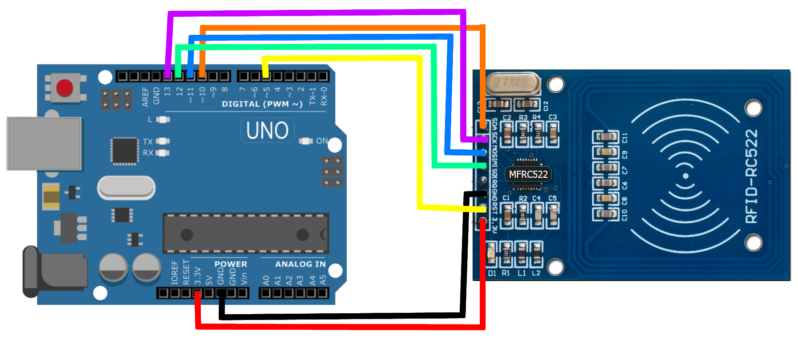

# MFRC522 RFID Card Reader/Writer with Arduino
#### Original code that inspires much of this code: https://www.instructables.com/ESP32-With-RFID-Access-Control/

## Usage
Simply upload the code to your Arduino, and wire the MFRC522 circuit like shown in here:  
- MFRC_PIN -> ARDUINO_PIN
- RST -> 5
- SDA -> 10
- MOSI -> 11
- MISO -> 12
- SCK -> 13
- GND -> GND
- 3.3V -> 3.3V

